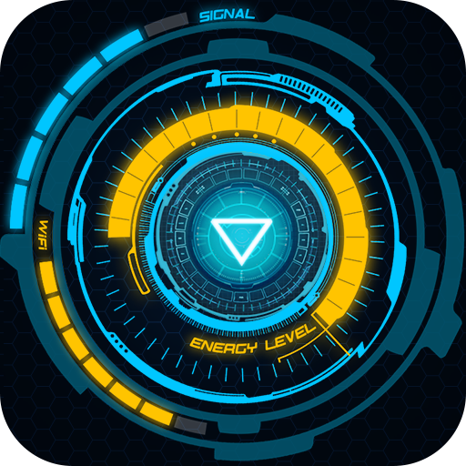

<!-- PROJECT LOGO -->
 

    
  </a>
  <h2 align="center">Joint Artificial Reasoning and Visual Interaction System (J.A.R.V.I.S)
    Discord Summarizer Bot</h3>

# Description
Discord bot for summarizing the last n messages by a user. Uses OpenAI and a custom assistant. Uses discrod '/' command interactions.

# Supported commands:
- @{bot name} -  A set of fixed text replies to test the bot
- /check OpenAPI key
- /cost
- /summary from time to time (from_time) (to_time)
- /help
- /unread summary

# Usage:
- Add the Discord token, OpenAPI key, Assistant ID are in a .env file in the root folder.
- Run main.py